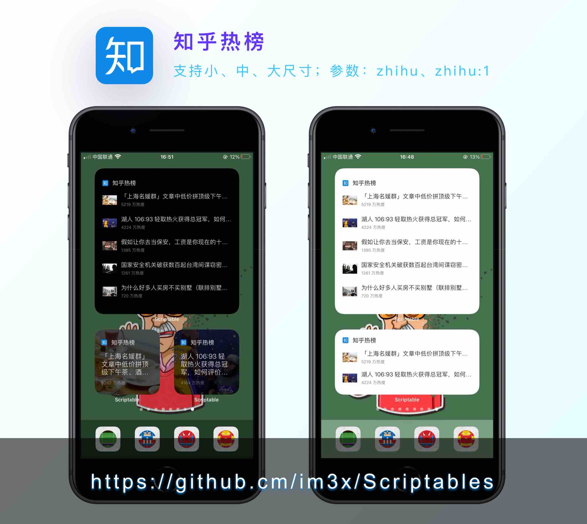

# 知乎热榜

# 支持组件
1. 小尺寸（支持传递 int 参数，显示第 n 个文章，默认0）    
2. 中尺寸    
3. 大尺寸    

# 参数格式

`zhihu`

# 参考资料
热榜链接：https://www.zhihu.com/billboard    
接口解析方法：页面中有 `id="js-initialData"` 的 script dom，解析这个内容，用 `JSON.parse` 即可转换数据
